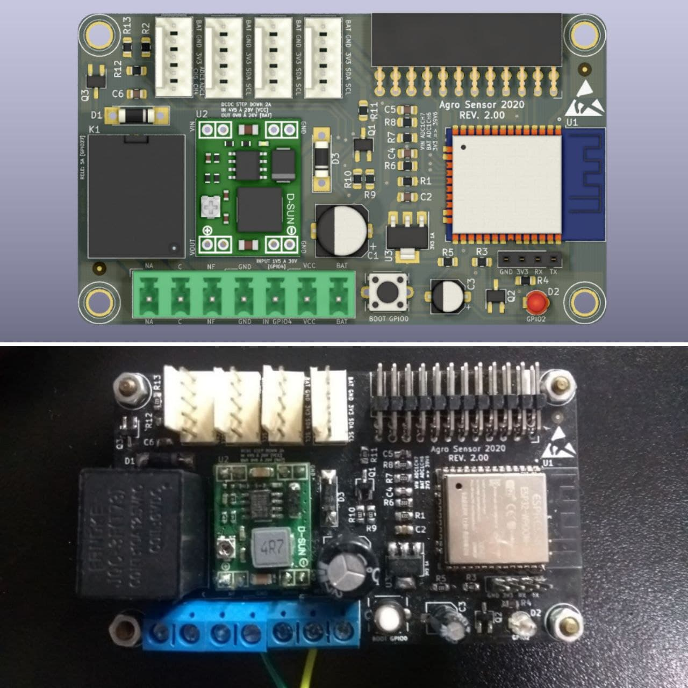
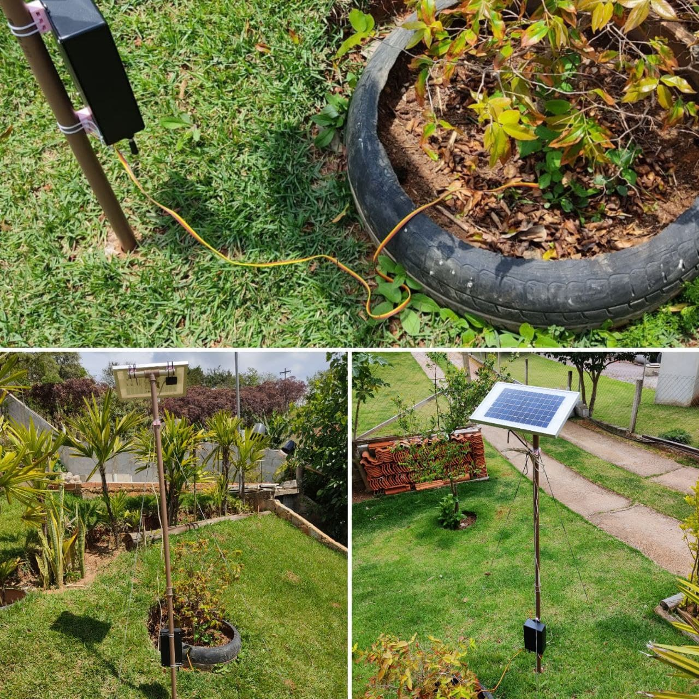
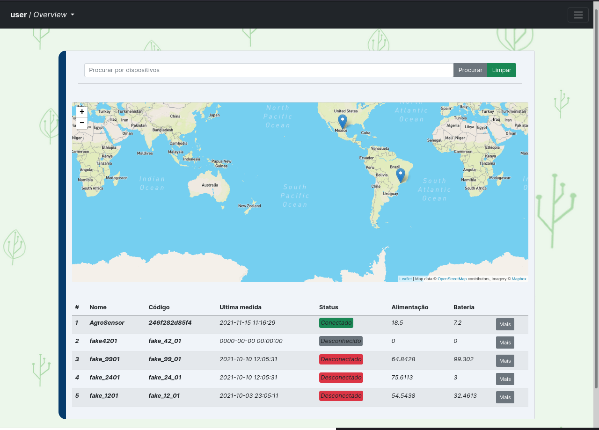
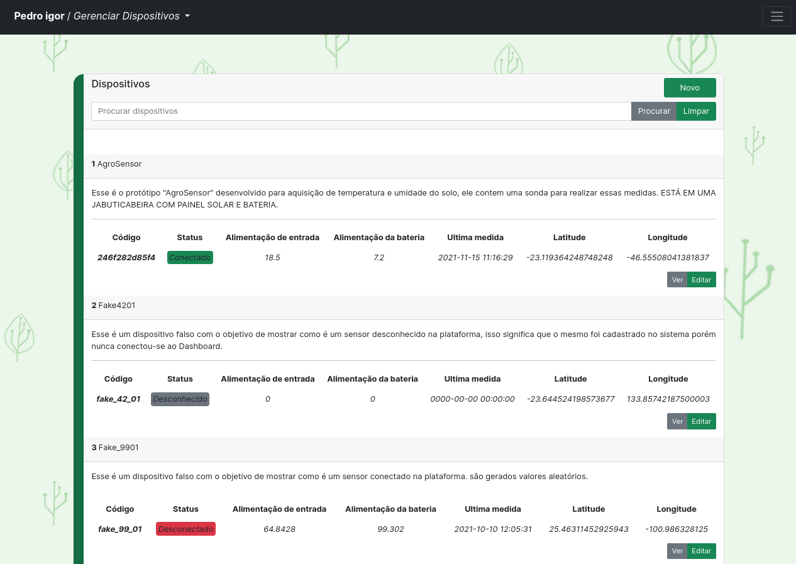
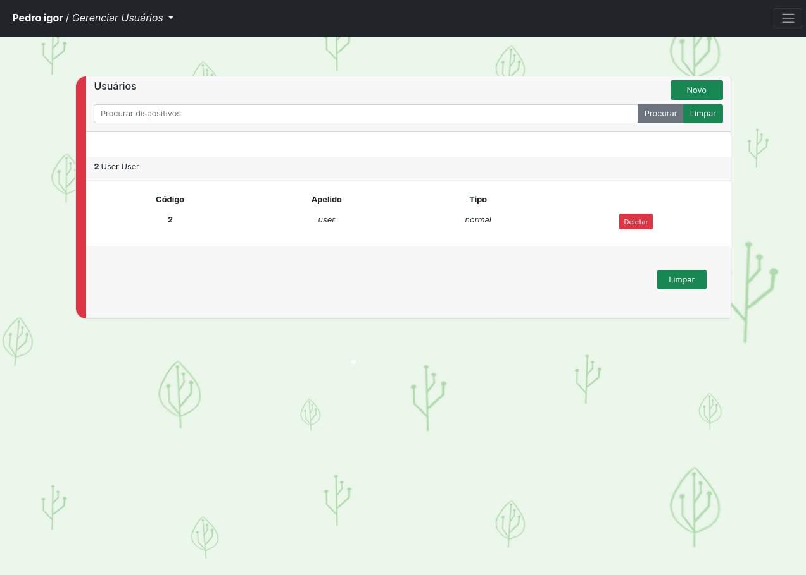

# **agroSensor**

Projeto de TCC do curso de Analise em Desenvolvimento de Sistemas do Instituto Federal-SP campus guarulhos.

## **Organização**

Diretório			| Descrição
:------------------------------ | :-------------------------------------
[case](./case)			| Projeto e arquivos fontes da case
[doc](./doc)			| Documentação do projeto
[img](./img)			| Imagens do projeto
[web](./app/data/webServer)	| Código fonte da web

 

### **Aplicação completa** 

Para facilitar o trabalho de desenvolvimento e deploy esse projeto utiliza docker para executar as aplicações web das quais: 
  * Banco de dados
  * Servidor M2M
  * Servidor web

## **Imagens**

