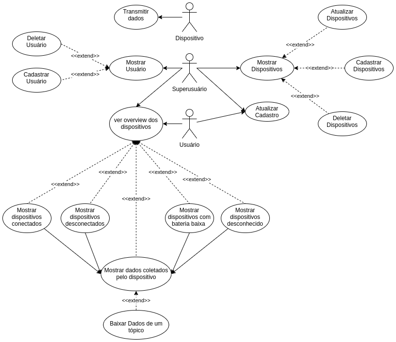
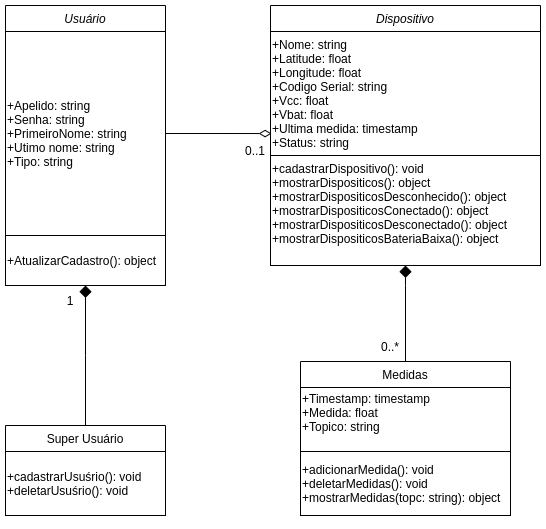
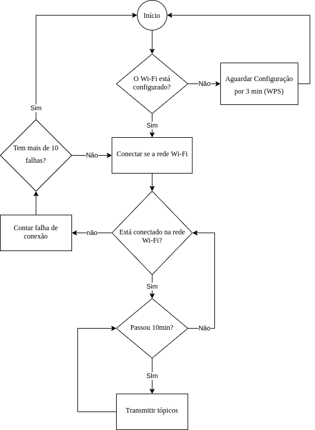

# **Diagramas**

## **Diagrama de Casos de Uso**

## **Diagrama de Classes**

## **Diagrama de Deployment**

## **Diagrama de Componentes**

## **Diagrama de Sequência**

## **Floxograma da Firmware**

